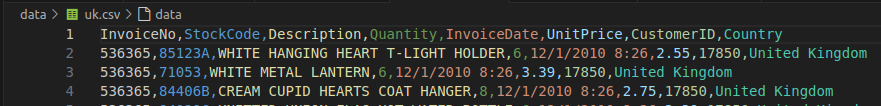
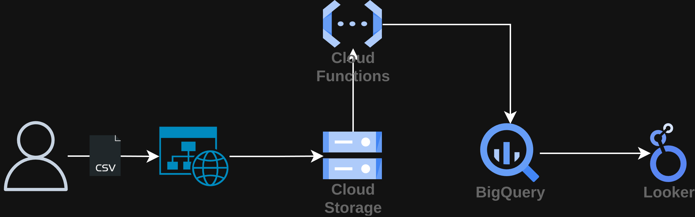
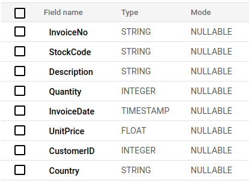
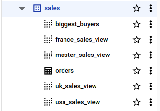
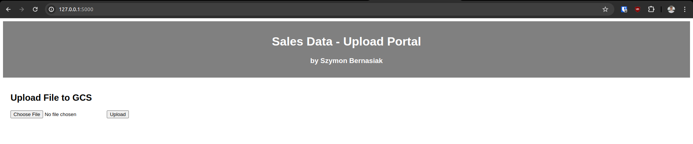
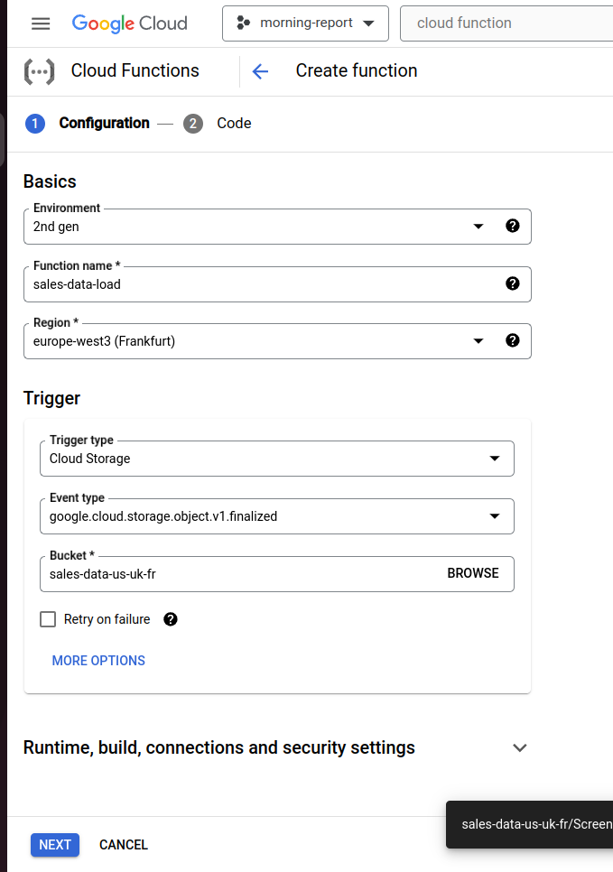

## 0. Intro
This project is based on Vishal Bulbule's [sales data pipeline project](https://github.com/vishal-bulbule/sales-data-pipeline-project/tree/master).

## 1. Project Overview
- **Project Name:** Create data pipeline for sales data
- **Project Description:** This project is to allow a smooth process of uploading sales data & visualizing this data in a report. It will allow company executives to make better informed decisions.

## 2. About
### Data Sources
I used [E-Commerce Data](https://www.kaggle.com/datasets/carrie1/ecommerce-data/data) dataset from Kaggle. This file contains data in the below sample format.



### Data Transformations
1. I manually split the file into three sub-files, each containing data for:
   1. USA
   2. UK
   3. France
2. Other than that, no data transformations. It is loaded to the *sales* table exactly as in the .csv file.

### Target Systems
- BigQuery dataset for storing tables
- Looker for visualizing data

## 3. Architecture
### High-level Architecture


### BigQuery database schema
All of the data flows to one table: \


From that table, a few reporting-level views are created: \


### Technologies Used
| Technology                 | Used for:                                                           |
|----------------------------|---------------------------------------------------------------------|
| Python Flask               | creating a simple webpage for uploading the data                    |
| Google Cloud Storage (GCS) | Storing the files uploaded by users                                 |
| Cloud Functions            | Creating a “sensor” script which uploads files from GCS to BigQuery |
| BigQuery                   | Storing the data (& its views)                                      |
| Looker                     | Visualizing the data                                                |

## 4. Step-by-Step Guide
### Prerequisites:
- No specific local setup required
- Google Cloud Platform:
  - free trial account is sufficient
  - User with owner role
  - Enabled APIs: Storage API & BigQuery API (Google might ask for a few additional APIs, just enable them when prompted)

### Configuration:
1. Locally:
   1. configure your ADC credentials ([instruction](https://cloud.google.com/docs/authentication/provide-credentials-adc#google-idp)):
      1. Here's what to do if you're having any access issues:
          ```python
          # Verify that the below file shows the right project
          nano /home/szymon/.config/gcloud/application_default_credentials.json

          # If Not ->
          gcloud auth application-default revoke

          gcloud auth application-default login --project=morning-report-428716
          ```
      2. run [main.py](main.py). It will create a simple web page for uploading the data:
      
   
2. Create Bucket:
    1. *sales-data* (for storing uploaded files)
3. Create Cloud Function *sales-data-load*
   1. Set the trigger on your GCS bucket \
    
   2. Update Cloud Function code with your code (from [cloud_functions](cloud_functions) folder)
4. In BigQuery:
    1. Create dataset *sales*
    2. Don't create a table. It will be auto-created once you upload your first file.
5. Locally:
   1. Go to the webpage for uploading data (http://127.0.0.1:5000/)
   2. Upload france.csv, usa.csv & uk.csv
6. In Bigquery:
   1. Verify that *sales* table got created
   2. Create views (see [bigquery.sql](bigquery.sql))
7. In Looker:
   1. Create report, sample: \
      

### Execution:
Your Cloud Function will add new data to the *sales* table every time a sales rep uploads the data via your webpage. \
Your Looker Report will be auto updated.